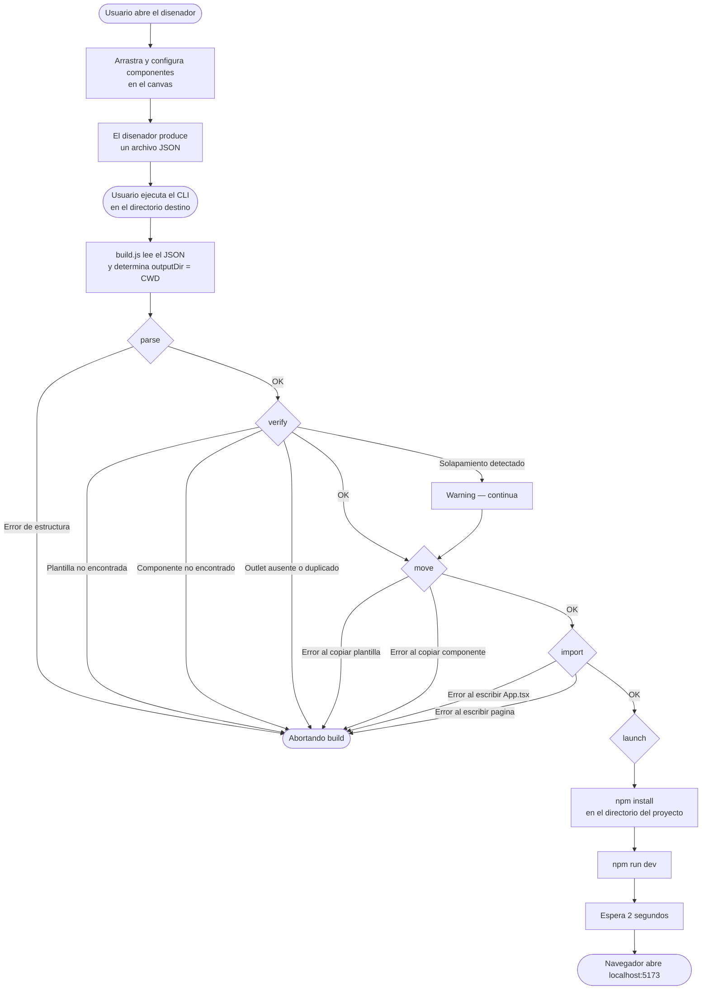

# Flujo completo del sistema

## 1. Vision general

El sistema tiene tres actores: el disenador (frontend), el pipeline (backend Node.js) y el
proyecto generado (React + Vite que se crea en el directorio del usuario).

El usuario interactua en dos momentos: primero en el disenador para crear su layout, y luego
ejecutando un comando en la terminal para lanzar la generacion.

---

## 2. Diagrama de flujo



---

## 3. Descripcion de cada fase

### 3.1 Disenador (fuera del scope del pipeline)

El usuario compone su pagina en una interfaz visual. El disenador exporta un JSON con la
estructura definida: seccion `installation` con la plantilla, el shell global y la cuadricula,
y seccion `pages` con el arbol de nodos de cada pagina.

### 3.2 CLI — build.js

Punto de entrada para el usuario. Se ejecuta desde cualquier directorio con:

```
node /ruta/a/TFG/build.js ./mi-diseno.json
```

Lee el JSON del archivo indicado, toma `process.cwd()` como directorio de salida y llama
directamente a la funcion `generate()` del pipeline sin pasar por HTTP.

### 3.3 parse — parser.js

Valida que el JSON tiene la estructura minima requerida y lo normaliza en un objeto
con los campos que necesita el resto del pipeline: `projectName`, `template`, `grid`,
`shell`, `pages` y `components` (lista deduplicada de componentes de biblioteca).

Lanza un `Error` con mensaje descriptivo si falta cualquier campo obligatorio.

### 3.4 verify — verify.js

Comprueba que los recursos referenciados por el JSON existen fisicamente en disco:

- La carpeta de la plantilla existe en `repository/templates/`.
- Cada componente de biblioteca tiene su carpeta y al menos un `.tsx` en `repository/components/`.
- El shell contiene exactamente un nodo `Outlet`.
- No hay nodos hermanos con layout solapado en ninguna pagina (warning, no bloquea).

Si hay errores bloqueantes el pipeline se detiene aqui.

### 3.5 move — move.js

Copia los recursos del repositorio local al directorio de salida:

- Copia `repository/templates/<template>/` → `<outputDir>/<projectName>/` (sin `node_modules/`).
- Copia `repository/components/<name>/` → `<projectPath>/src/components/<name>/` por cada componente.

En v2 esta fase podria sustituirse por descargas HTTP desde un servidor remoto sin modificar
el resto del pipeline.

### 3.6 import — import.js

Genera el codigo TypeScript/React del proyecto:

- Sobreescribe `src/App.tsx` con: imports de componentes, `BrowserRouter` + shell JSX + `Routes`
  con una `Route` por pagina.
- Crea `src/pages/<PageId>.tsx` por cada pagina con los imports necesarios y el JSX del `body`
  aplicando CSS Grid mediante `style={{ gridColumnStart, gridColumnEnd, gridRowStart, gridRowEnd }}`.

### 3.7 launch

Ejecuta el proyecto generado en el directorio del usuario:

1. `npm install` — instala las dependencias (salida visible en consola).
2. `npm run dev` — arranca el servidor de desarrollo de Vite.
3. Tras 2 segundos abre `http://localhost:5173` en el navegador por defecto del sistema.

---

## 4. Estructura del proyecto generado

Tras ejecutar el pipeline, el directorio de salida contiene:

```
<outputDir>/
  <projectName>/
    index.html
    package.json           (con react-router-dom ya incluido)
    vite.config.ts
    tsconfig.json
    src/
      main.tsx
      App.tsx              (generado por import.js)
      index.css
      App.css
      assets/
      components/
        <nombre>/          (copiado desde repository/components/)
          <nombre>.tsx
          <nombre>.module.css
      pages/
        <PageId>.tsx       (generado por import.js por cada pagina)
```

---

## 5. Separacion de responsabilidades

| Archivo        | Responsabilidad                                             |
|----------------|-------------------------------------------------------------|
| build.js       | CLI: leer JSON, determinar outputDir, invocar generate()    |
| parser.js      | Validar y normalizar el JSON de entrada                     |
| verify.js      | Comprobar que los recursos existen en repository/           |
| move.js        | Copiar template y componentes al outputDir                  |
| import.js      | Generar App.tsx y src/pages/*.tsx                           |
| builder.js     | Orquestador: encadena las fases, gestiona errores globales  |
| functions.js   | Utilidades compartidas: STRUCTURAL_COMPONENTS, walkTree, log|
